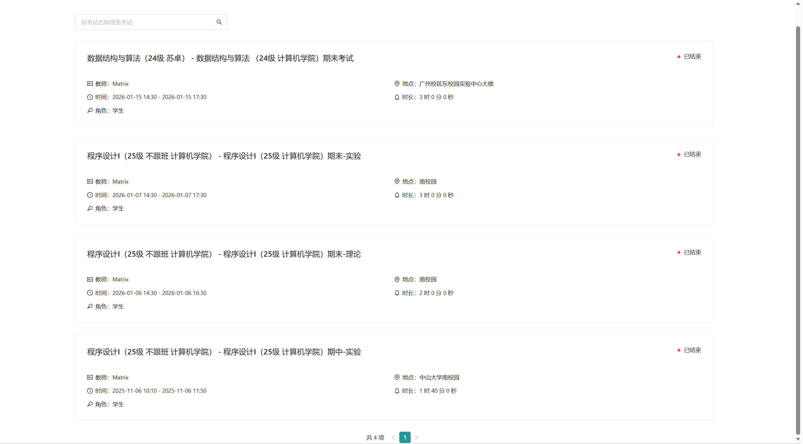
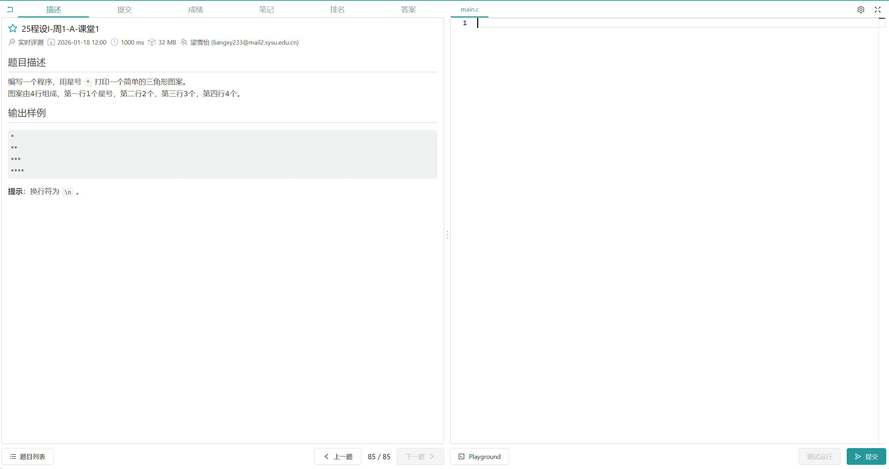
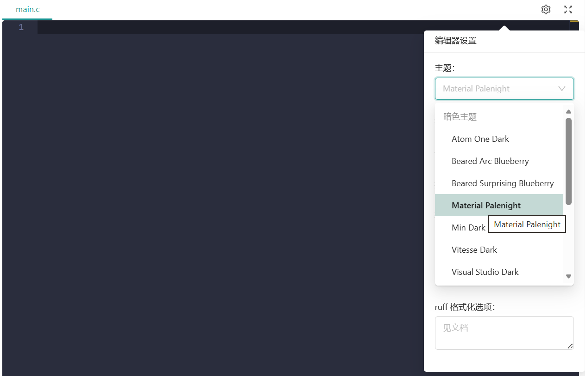
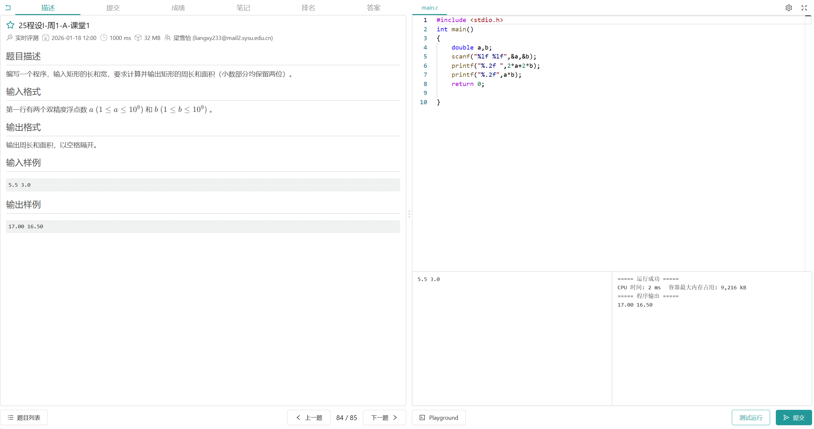
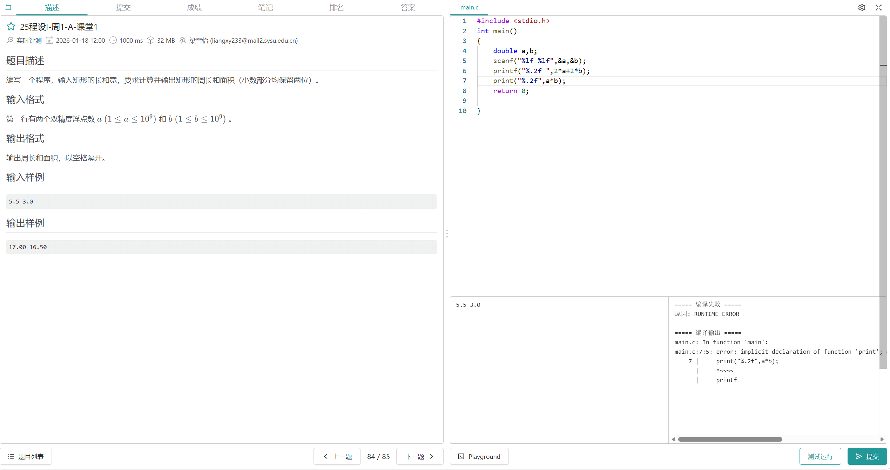
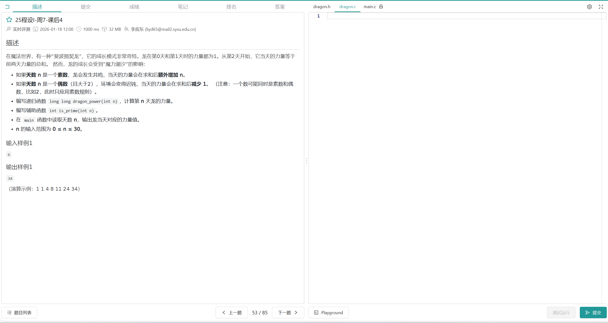
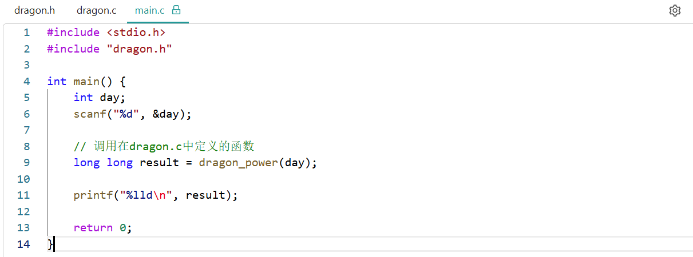
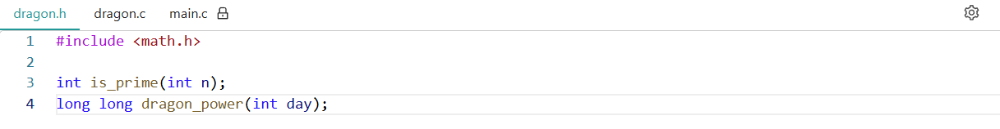
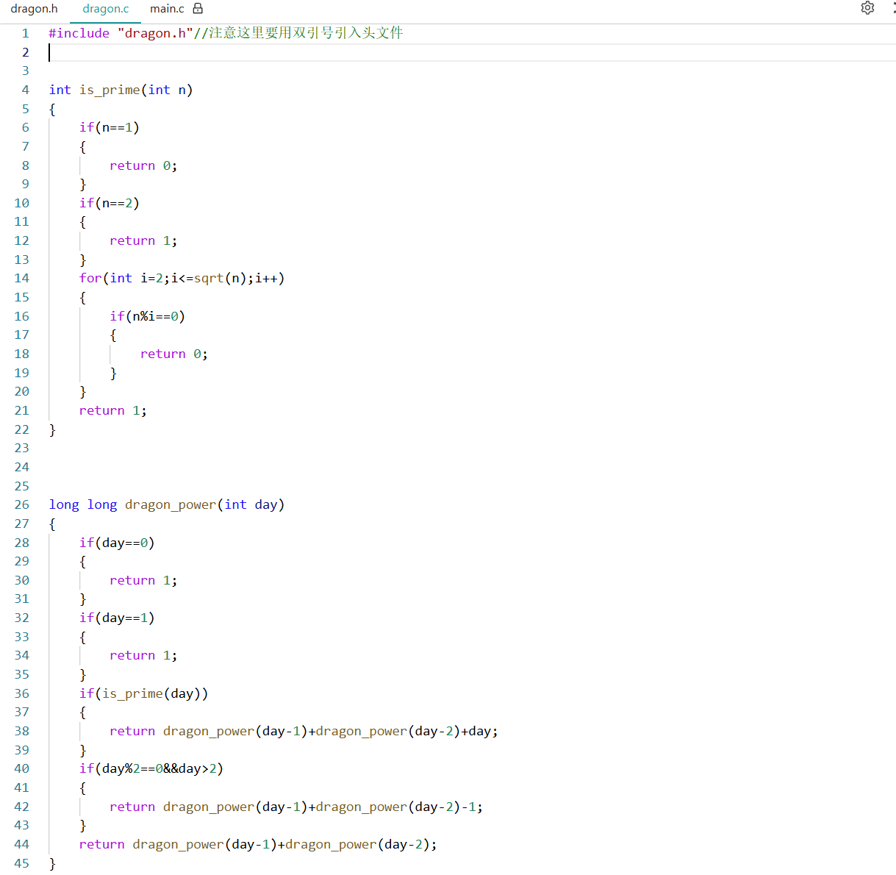

## Matrix考试界面介绍

Matrix是计算机学院转专业考核中用于机考的OJ平台。考生们需要在该平台上完成对应的编程题目。

考虑到参与转专业的非计类学院学生也许在开考之前都没有接触过这一平台，从而在编写代码及在线调试时出现问题，故编写此文档，希望让大家熟悉这一平台的使用。

初次编写类似教程文档，难免出现缺漏，也欢迎提交PR来补充整个教程的内容。

### 登录页面

在进入Matrix的做题界面前，需要进行登录。账号和密码会由教务老师在开考前几天通过邮件的方式发给参与转专业考试的同学，这里只需要输入自己的账密就能正常登录了。

### 考试入口界面

在登录完后，一般会进入准备考试的界面，大致窗口如下所示。在正常情况下，应该会显示“202X年转专业考核”的考试信息，并在右上角有开考时间的倒计时。这里由于笔者暂时没有正在进行的考试，因此无法完全展示，大致界面如下：

### 做题界面

由于Matrix本身也是计院用于程序设计I和II以及数据结构与算法的教学/考试平台。练习题和考试题的界面差别不大，因此这里就以练习题的界面为例。

画面左侧是题目描述，右侧是代码编写区域。

如果你觉得白色界面不太符合你的IDE自定义风格，也可以打开右上角设置按钮，切换至你喜欢的风格。

接下来介绍Matrix的Playground，即在线测试运行这一功能。

在编写完代码后，我们可能想在提交前确认下是不是输出已符合题意，这时就可以用Playground。

如果题目中给了样例输入，那么就可以在Playground菜单的左侧粘贴这一输入后，点击测试运行，即可在右侧看到输出的结果。当然如果代码编写有误，右侧则也会展示出对应的报错信息，可以据此来Debug代码：

在测试完并点击提交后，我们会看到当前题目的成绩，其可能包含标准测试、随机测试、编译检查、内存检查等等检查点，检查点的项以及分数占比都不固定，会随题目不同而变化。

一道题的满分是100分，在机考中一般一共有10道题，总分为1000分。

如果题目实在不会或时间来不及，并不意味着这道题会拿0分。实际上，如果那道题有编译检查这一项的分数，我们可以通过仅写出能够通过编译的代码来“骗”到这一分数。当然，对于标准测试，也可以观察其样例输入来“打表”。由此一来，即使某道题不会做，我们也可以拿到20%-40%不等的分数。

### 关于多文件

在Matrix中，多文件题目非常常见，比如下面这道题

可以看到`main.c`旁有一个锁的标志，这说明该文件是只读的，我们能够编写的只有`dragon.h`和`dragon.c`中的代码。

通过阅读main函数了解其执行流程，在`dragon.h`中补上对应的函数声明，并在`dragon.c`中实现函数的定义即可。

